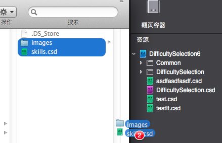

# 用Photoshop自动创建CocosStudio .csd文件（Scene/Layer/Node）

> 如觉得看文字累，可以先看下[视频演示（点击观看）](http://v.youku.com/v_show/id_XOTE0NzE2NDg0.html)，了解工具带来的轻松和方便。

工欲善其事必先利其器，趁手的工具会让生活美好许多，虽然Cocos2d-x，提供了Cocos Studio 2编辑器，但是在美术人员把美术部分绘制完成后，要在Cocos Studio 2编辑器呈现出来，确是个工作量比较大的体力活，首先美术人员要把美术元素切成小图，然后编辑器使用人员，根据效果图把美术人员提供的小图在编辑器中拼接出来，这几步操作非但没有技术含量，又特别费工时，于是就有了‘PhotoshopLayerToCocosStudioCSD’这个工具，让美术和编辑器使用人员，可以节省大量时间去上上网，聊聊天。

#工具介绍

用Photoshop自动创建CocosStudio .csb文件（Scene/Layer/Node）的工具，是：[LayersToCSD.jsx（点击下载）](https://github.com/sunjianhua/PhotoshopLayerToCocosStudioCSD/releases/download/1.0.1/LayersToCSD.jsx)，这是一个photoshop脚本文件，安装和使用非常方便，这个photoshop脚本，改编自[Spine](https://www.esotericsoftware.com)的LayersToPNG.jsx脚本，只是修改了里面的文件输出部分和增加了一个.csb类型选择，所以会看到操作界面基本是相同的。

这个工具的调试用的是：Adobe Photoshop CS6，其它版本没测试过。

输出的csd文件格式为Cocos Studio 2的v2.1.5版本，其它版本没测试过。

##安装
安装非常简单，只要下载[LayersToCSD.jsx（点击下载）](https://github.com/sunjianhua/PhotoshopLayerToCocosStudioCSD/releases/download/1.0.1/LayersToCSD.jsx)，然后把文件放到photoshop的‘Scripts’目录就可以了。

photoshop的‘Scripts’目录详细路径：photoshop安装盘\photoshop文件夹\Presets\Scripts\

##使用
使用非常简单，只要两步：

1. 在photoshop中，打开要输出的文件，选择photoshop的‘文件’菜单，再选择‘脚本’子菜单就可以看到‘LayersToCSD’这个子菜单，点击，弹出操作窗口，如果没什么修改，直接点‘ok'按钮。 

2. 把上一步生成的.csd文件和images文件，拖拽到Cocos Studio 2编辑器已打开的工程。 

经过上面两步操作，又可以继续刷微信，看淘宝了。

#附加信息
1. 默认输出的.csb类型为Scene，在弹出窗口的Type下拉框，可以选择：Scene/Layer/Node，分别对应.csb的Scene/Layer/Node。

2. photoshop画布大小要和Cocos Studio 2场景编辑器中的画布大小相同？？？不然会出现拉伸变形？？？这个没实际测试。

3. 因为要在photoshop中，把每个层转换为图片存储到磁盘，这个操作会慢一些，在开始执行后，稍等一下，会看到在photoshop中出现一些额外的操作窗口，等这些额外的操作窗口，自动执行完全部操作，并自动关闭，转换就全部结束了，如果都是按默认操作执行，可以到.psd文件存放目录，看到新增加了一个.csd文件和一个images文件夹（这个操作都是自动操作，不用干预）。

4. 用这个工具生成的.csd文件，‘NodeObjectData’都为’SpriteObjectData‘，如果能在Cocos Studio 2中可视化修改对象类型就方便多了。

5. 如果想测试工具方便性，手头又没有.psd文件，提供了一个测试文件：[skills.psd（点击下载）](https://github.com/sunjianhua/PhotoshopLayerToCocosStudioCSD/blob/master/skills.psd)，这个文件来自网络免费资源。

6. 这个工具可以完善的地方比较多，比如美术人员在photoshop设计好以后，执行脚本，可以直接打开Cocos Studio 2看在编辑器效果，不过没什么实用价值，让美术额外装一个比较难用的Cocos Studio 2，还是放弃吧。

7. 这个工具可以完善的地方比较多，比如可以在photoshop的Layer增加些关键字，可以直接用工具生成Cocos Studio 2编辑器用到的‘按钮’、‘复选框、‘输入框’等控件，让美术做额外的工作，貌似也不太好，放弃。

8. 这个工具不支持中文，因为Spine的LayersToPNG.jsx脚本就不支持，哈哈。

9. 如果没有在弹出窗口设置.csb文件名，这个工具根据.psd的文件名，生成.csd的文件名。

10. 这个工具根据photoshop中Layer的名字，来生成图片的名字，所以这个要策划先把命名规则给美术沟通好，游戏用图的命名规则，就是photoshop中Layer的命名规则，因为不支持中文，所以如果photoshop中Layer名为中文，那么最终输出的图片名为乱码？？？

11. 这个工具可能没后续完善，希望Cocos Studio 2编辑器开发方能出一个完善的photoshop插件。

12. 给美术推荐方便在真机上看设计效果的利器：[ps play](http://isux.tencent.com/app/psplay)，这是别人开发的，有问题就问别人。

13. 最后附上[完整操作视频（点击观看）](http://v.youku.com/v_show/id_XOTE0NzE2NDg0.html)。

